# Proyecto Git Flow
Practica de Git Flow y Convetional Commits

# ¿Que es Git Flow?

Git Flow es una estrategia de ramificacion que permite organizar el desarrollo mediante ramas especificas para nuevas funcionalidades (feature), preparacion de versiones (release) y correcciones urgentes (hotfix)

### Creamos un print
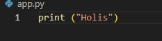
### Hacemos un convetional commit
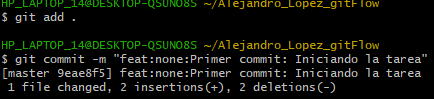
### Inicializamos Git Flow
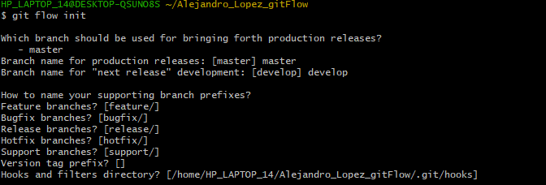
### Creamos una feature
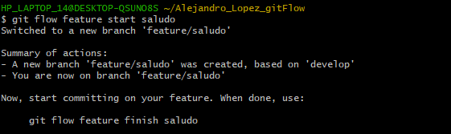
### Agregamos una funcion al archivo .py
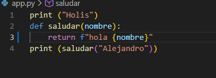
### Hacemos otro convetional commit 
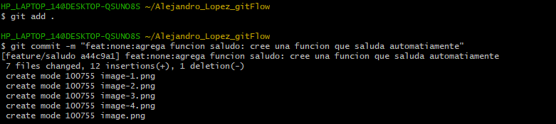
### Mejore el mensaje del archivo .py
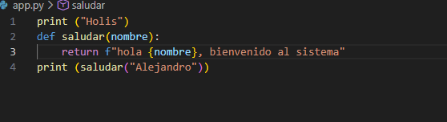
### Lo guardo
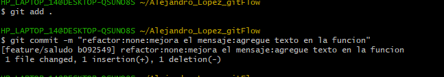
### Finalizamos el Git Flow
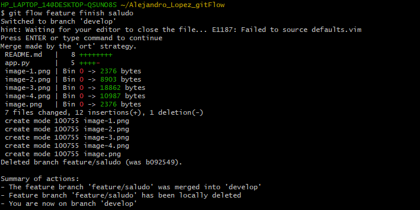
### Creamos el git release
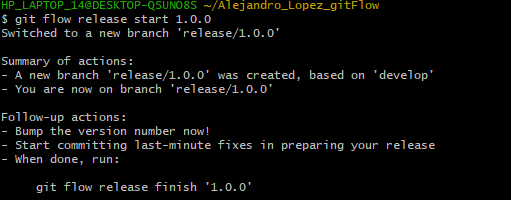
### Guardamos cambios en README.md
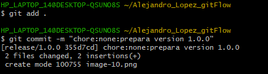
### Finalizamos el release
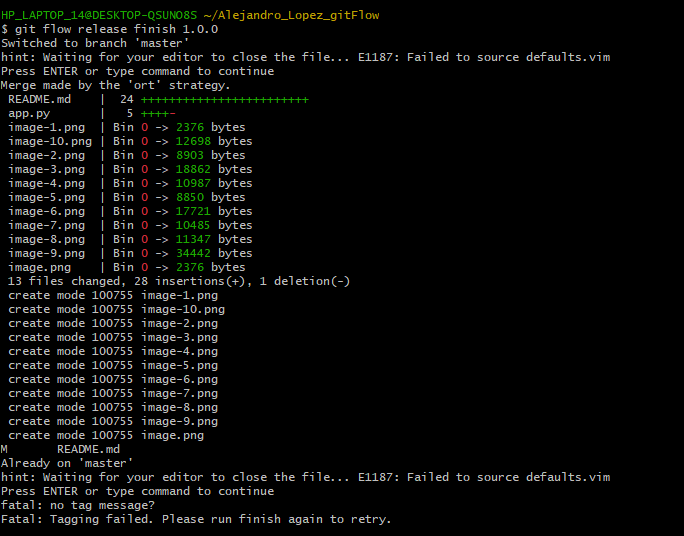
### Creamos el hotfix
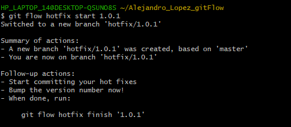
### Cambiamos algo del codigo
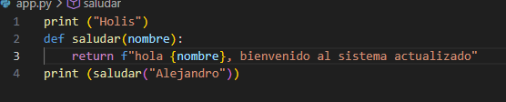
### Guardamos y finalizamos el hotfix
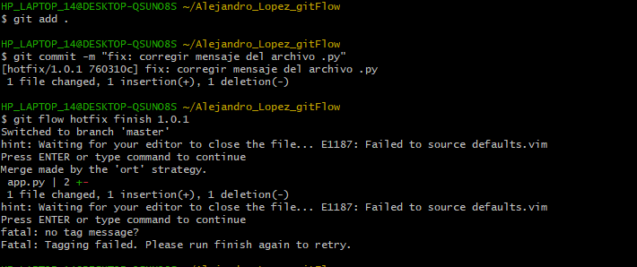
## Error
- No aparecen las versiones en git tag
## Solucion:
- Primero vemos si se guardaron correctamente los cambios
- Luego revisamos en que parte esta el release y el hotfix
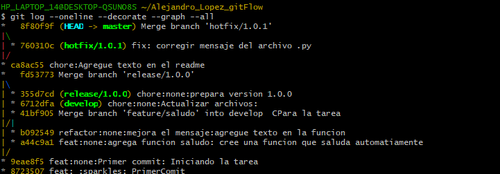
### Agregamos manualmente el git tag de cada uno
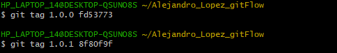
### Corroboramos que aparezcan 
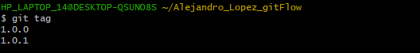

### Creamos el repositorio 
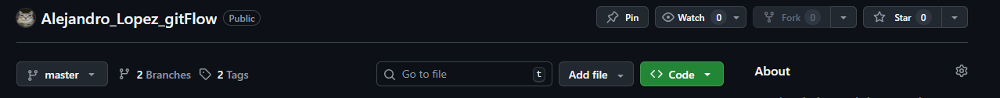

### Ahora subimos todo al repositorio
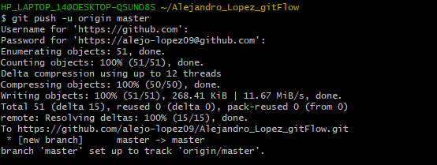

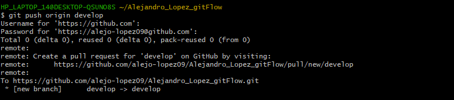

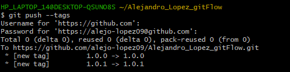

# Estructura de Ramas

### master: rama principal de produccion
### develop: rama de desarrollo
### feature/saludo: implementacion de nueva funcionalidad
### release/1.0.0: preparacion de version
### hotfix/1.0.1: correccion urgente en produccion

# Conventional commits
Se utilizo el estandar Convetional commits para estructurar los mensajes de commit:
- feat: nuevas funcionalidades
- fix: correccion de errores
- refactor: mejoras internas
- chore: tareas de mantenimiento

# Finalizamos con la lista de comandos utilizados

## 1. Crear carpeta del proyecto

  -  mkdir Alejandro_Lopez_gitFlow

  -  cd Alejandro_Lopez_gitFlow

## 2.  Inicializar repositorio Git

  - git init

  - Crear archivos base

  - touch README.md

  - touch app.py

  - Realizar el primer commit

  - git add .

  - git commit -m "feat: estructura inicial   del proyecto"

## 3.  Inicializar Git Flow

  - git flow init

  - Configuración utilizada:

  - Rama de producción: master

  - Rama de desarrollo: develop

  - Prefijos: valores por defecto

  - Crear una feature

  - git flow feature start saludo

  - Realizar commits dentro de la feature

  - git add .

  - git commit -m "feat: agregar funcion saludar"

  - git add .

  - git commit -m "refactor: mejorar mensaje de la funcion saludar"

  - Finalizar la feature

  - git flow feature finish saludo

## 4. Crear una release

  - git flow release start 1.0.0

  - git add .

  - git commit -m "chore: preparar version 1.0.0"

  - git flow release finish 1.0.0

## 5. Crear un hotfix

  - git flow hotfix start 1.0.1

  - git add .

  - git commit -m "fix: corregir mensaje del archivo .py"

  - git flow hotfix finish 1.0.1

## 6. Crear tags manualmente (si no se generaron automáticamente)

  - git tag 1.0.0

  - git tag 1.0.1

  - git tag

  - Ver historial completo

  - git log --oneline --decorate --graph --all

## 7. Conectar repositorio con GitHub

  - git remote add origin https://github.com/alejo-lopez09/Alejandro_Lopez_gitFlow.git

  - git remote -v (Para verificar si se subio)

## 8. Subir proyecto a GitHub

  - git push -u origin master

  - git push origin develop

  - git push --tags